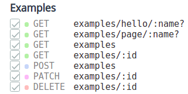

# Rightech IoT user module example

Basic user module for [Rightech IoT](https://rightech.io/) platform.


```
.
├── datarc.examples.js   # Example data store manifest
├── index.js             # Server module entrypoint (js only)
├── js/index.ts          # Client module entrypoint (ts, tsx, js, jsx)
├── assets               # Client resources - icons, styles, files, etc
└── templates            # Static pug templates (client or server)
```

### Install

```sh
> cd ric-web
> git clone https://github.com/prohazko2/ric-user-module user_modules/examples

> npm run build:user
> npm start
```

or with [docker](https://github.com/prohazko2/ric-build-root)

#### [server](./index.js)



##### custom
- [`GET /examples/hello/:name`](http://localhost:3000/api/v1/examples/hello/test) - custom api route
- [`GET /examples/page/:name`](http://localhost:3000/api/v1/examples/page/test) - custom html page

##### default
- [`GET /examples`](http://localhost:3000/api/v1/examples) - query all items
  - [`GET /examples?only=name`](http://localhost:3000/api/v1/examples?only=name) - query items with only `name` field
  - [`GET /examples?where.value>=20`](http://localhost:3000/api/v1/examples?where.value>=20) - query items where `value` field more than 20
  - [`GET /examples?unwrap=object`](http://localhost:3000/api/v1/examples?unwind=object) - unref object referenced  by `object` field
  - [`GET /examples?streamed&limit=2`](http://localhost:3000/api/v1/examples?streamed=true&limit=2) - query first 2 items in steamed mode
- `POST /examples` - create new item
- `PATCH /examples/:id` - update any item
- `DELETE /examples/:id` - delete any item


#### [10-main](./10-main/index.tsx)

- use 3rd-party [`react-grid-layout`](https://github.com/react-grid-layout/react-grid-layout) library as example
- use `module.save` API to persist layout changes (`PATCH /examples/:id`)
- listen module events (`select` and `staged`)

#### [20-top](./20-top/index.tsx)

- use bundled [`mobx`](https://github.com/mobxjs/mobx) library for state managment
- listen `WebSocket` events (`object-packet`)
- use `objects` base module for navigation and formatting

#### [30-api](./30-api/index.tsx)
- call custom API method `GET /examples/hello/:name?`

#### [40-inject](./40-inject/)
- inject custom [page](./40-inject/page.tsx) to `objects` module
- inject custom [view](./40-inject/view.js) to `objects` module (also no `react` or `ts`)

